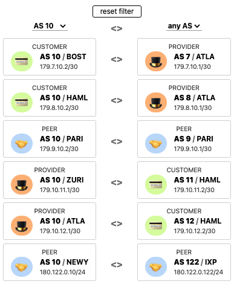

# Routing with BGP
Configuring BGP routing on a virtual network using shell scripts.



## Project 🌳
```
BPGRouting/
├── configs
│   └── saved_configs
├── docs
│   ├── as10_connections.png
│   ├── as29_connections
│   ├── as29_connections.png
│   └── figure2.png
├── README.md
└── scripts
    ├── generate_config_ext.sh
    └── generated
        └── ext
            ├── ATLA_ext_32_ZURI
            ├── BOST_ext_27_ZURI
            ├── HAML_ext_28_ZURI
            ├── NEWY_ixp_122
            ├── PARI_ext_30_PARI
            └── ZURI_ext_31_ZURI
```

### Usage
From the project root directory, generate configurations and update the routers:
```bash
./scripts/generate_ebgp_config.sh
./scripts/update.sh
```

## Commands
1. To generate eBGP configurations use `generate_ebgp_config.sh`.
2. To generate iBGP configurations use `generate_ibgp_config.sh`.
3. To update configs on routers use `update.sh`.
4. To get saved configs use `get_configs.sh`.
5. To reset configs use `reset.sh`.
